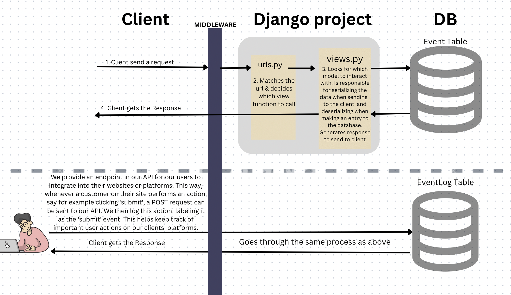
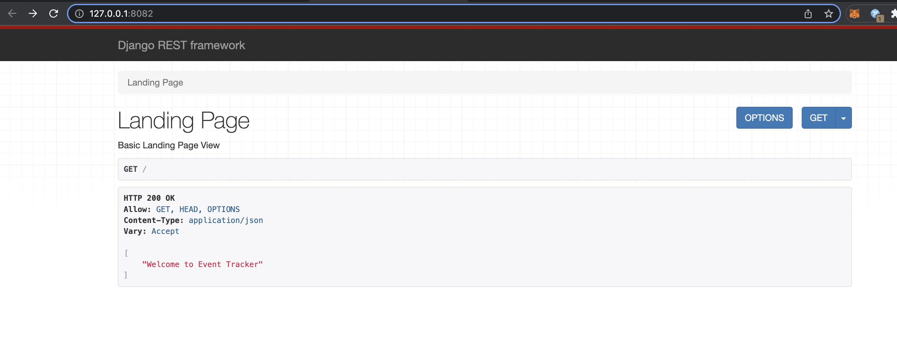

# event-tracker: flexible event tracking API


## ABOUT:

Welcome to EventTrackr, a robust and scalable event tracking system that caters to the unique requirements of you and your platform. Our application allows you to create & manage custom events, and then track those events on your websites. Using our API will enable you to gain insightful data and analytics about user behaviors, leading to more informed decision making and strategic planning.

## Table of Contents

- [ARCHITECTURE](#architecture)
- [INSTALLATION INSTRUCTIONS](#installation-instructions)
- [THIS SOLUTION SHOULD PROVIDE](#this-solution-should-provide)

## ARCHITECTURE

**Data Model:**
EventTrackr's data model is comprised of three components: User, Event, and Event Log.

1. _User Table_: The User model is Django's built-in model for authentication. It includes fields like username, password, email, first_name, last_name. It is used for authentication and represents the users of our API.

2. _Event Table_: The Event model represents an event created by a user. For example: a user of our API can create an event called "purchased" and set the description to "When someone purchases item". The fields of the Event model are:

- **user_id**: A foreign key to the User model. This is a many-to-one relationship where each user can create multiple events but each event is linked to a single user. If the user is deleted, all their events are also deleted due to the CASCADE on_delete policy.
- **name**: A char field that stores the name of the event.
- **description**: A text field that stores a description of the event.
- **created_at**: A datetime field that stores the date and time when the event was created. This field is automatically set when the event is created and cannot be changed manually.
- **modified_at**: A datetime field that stores the date and time when the event was last modified. This field is automatically updated every time an event is modified.

3. _EventLog Table_: The EventLog model represents an event created by our user's customer. Our user can use our API endpoint to POST to this table. So, when a customer who visits our user's website purchases an item, we get an event called "purchased", which we store in the EventLog table. The user can also try to capture special attributes, like {"total_amount":50, "quantity":2}, and send it in the data field. The fields of the EventLog model are:

- **creator_id**: A foreign key to the User model.
- **event_id**: A foreign key to the Event model. 
- **event_name**: A char field that stores the name of the event.
- **timestamp**: A datetime field that stores the date and time when the event took place. This field is automatically set when an event occurs.
- **data**: A JSON field that stores the data/additional properties of the event in JSON format.

The architecture of the EventLog model allows our users to record detailed, timestamped logs of events occurring on their website by their customers. These logs can be used later for detailed analysis and tracking of user behaviour and activities on the website.


**Diagram:**



## INSTALLATION INSTRUCTIONS

**Prerequisites**

Ensure that you have the following installed:
- Python3
- pip
- virtualenv

**Step-by-step Guide**

1. Clone the repository:

```sh
git clone https://github.com/shahwaiz14/event-tracker.git
```

Navigate into the project directory:

```sh
cd event-tracker
```

2. Create a virtual environment:

```sh
python3 -m venv env
```

Activate the virtual environment (for MacBook):

```sh
source env/bin/activate
```

3. Install the required packages

```sh
pip install -r requirements.txt
```

4. Open a new terminal window and create a database from your terminal. Make sure you have postgres installed on your machine.

```sh
createdb -h localhost -p 5432 -U shahwaiz EventManager
```

5. Set up the database (I am using postgresql). Add this to your `DATABASES` setting in `settings.py`. Make sure to add the `USER` property.

```python
DATABASES = {
    "default": {
        "ENGINE": "django.db.backends.postgresql_psycopg2",
        "NAME": "EventManager",
        "USER": {USER},
        "PASSWORD": "",
        "HOST": "localhost",
        "PORT": "",
    }
}
```

6. Run the following command to apply migrations:

```sh
python3 manage.py migrate
```

7. Run the server

```sh
python3 manage.py runserver
```

Visit http://localhost:{port_number} in your web browser to see your application running.

You should see a window like this:



### Creating a new user and login ###
You will not be able to make any request until you create a new user and login. You can do this through Django Rest Framework's browsable API or through command line.

Command Line Instructions:

8. Register a new user
```sh
curl -X POST http://127.0.0.1:8081/auth/users/ --data 'username=djoser&password=alpine12'
```

This will return: `{"email":"","username":"djoser","id":1}%` 

9. Log in
```sh
curl -X POST http://127.0.0.1:8081/auth/token/login/ --data 'username=djoser&password=alpine12'
```

This will return a auth token like this `{"auth_token": "b704c9fc3655635646356ac2950269f352ea1139"`. Store this token, as you will need it to communicate with EventTracker API.

10. Check if your token is working

```sh
curl -LX GET http://127.0.0.1:8081/auth/users/me/ -H 'Authorization: Token {your_token}'
```

This will return something like this: `{"email": "", "username": "djoser", "id": 1}`


## THIS SOLUTION SHOULD PROVIDE:

**Note:** Django Rest Framework's Browsable API is more intuitive to interact and to test this API. If you use the browsable API, you will need to install `modheader` chrome extension, so that it can pass the auth token in the header to all the requests you make to eventTracker API. However, if you want to use Python or terminal, here is the code to interact with the Event-Tracker API:

(Please ensure that you replace the port number in the URL with the appropriate port that your application is running on your local machine. Additionally, don't forget to add your authentication token in the Authorization header for all requests)

**1. Users should be able to get a list of events they have created**

Terminal:
```sh
curl http://127.0.0.1:8081/api/events/ -H 'Authorization: Token {your_token}'
```

Python:
```python
import requests

url = "http://127.0.0.1:8081/api/events/"
headers = {"Authorization": f"Token {token}"}

response = requests.get(url, headers=headers)

print(response.text)
```

You should get an empty list response, since no events have been created yet.


**2. Users should be able to create events. If you try to create a duplicate event, you will get an error.**

Terminal:
```sh
curl -X POST http://127.0.0.1:8081/api/events/ \
-H "Authorization: Token {token}" \
-H "Content-Type: application/json" \
-d '{"name":"test","description":"testing event creation"}'

```

Python:
```python
import requests
token = 'your_token'
url = "http://127.0.0.1:8081/api/events/"
headers = {
    "Authorization": f"Token {token}",
    "Content-Type": "application/json"
}
data = {
    "name": "test",
    "description": "testing event creation"
}

response = requests.post(url, headers=headers, json=data)
```


**3. Users can search the events they created via the title and description**

Terminal
```sh
curl 'http://127.0.0.1:8081/api/events/?search=test' -H "Authorization: Token {token}"
```

Python:
```python
import requests

url = "http://127.0.0.1:8081/api/events/"
headers = {"Authorization": f"Token {token}"}
params = {"search": "test"}

response = requests.get(url, headers=headers, params=params)

print(response.json()) 
```

In this case, you should get ["test].


**4. The user can update an event if needed**

Terminal:
```sh
curl -X PATCH http://127.0.0.1:8081/api/events/1 -H "Authorization: Token {token}" -H "Content-Type: application/json" --data '{"description":"modified description"}'
```

Python:
```python
import requests
import json

url = 'http://127.0.0.1:8081/api/events/1'
headers = {'Authorization': f'Token {token}', 'Content-Type': 'application/json'}
data = {'description': 'modified description'}

response = requests.patch(url, headers=headers, data=json.dumps(data))
```


**5. The user can remove an event if needed by passing in event_id as a path parameter**

Terminal:
```sh
curl -X DELETE http://127.0.0.1:8081/api/events/1 -H "Authorization: Token {token}"
```

Python:
```python
import requests

url = 'http://127.0.0.1:8081/api/events/1'
headers = {'Authorization': f'Token {token}'}

requests.delete(url, headers=headers)

```


**6. Users can use this endpoint to implement in their frontend (or their platform) so that we can log event’s data on their customers events.** Data field can't be null, so if you don't want to record data, pass `{}`.

Terminal:
```sh
curl -X POST http://127.0.0.1:8081/api/eventlogs/ \
-H "Authorization: Token {token}" \
-H "Content-Type: application/json" \
-d '{"event_name":"test","data":{"amount":50, "product_id":2}}'
```

Python:
```python
import requests

url = 'http://127.0.0.1:8081/api/eventlogs/'
headers = {
    'Authorization': f'Token {token}',
    'Content-Type': 'application/json'
}
data = {
    'event_name': 'purchased',
    'data': '{"amount": 50, "product_id": 2}'
}

response = requests.post(url, headers=headers, json=data)
```


**7. The user can view events trend data for their website**

Terminal:
```sh
curl http://127.0.0.1:8081/api/stats/event_trend -H "Authorization: Token {token}"
```

Python:
```python
import requests

url = 'http://127.0.0.1:8081/api/stats/event_trend'
headers = {'Authorization': f'Token {token}'}

response = requests.get(url, headers=headers)

if response.status_code == 200:
    data = response.json()
    print("Event trend:", data)
```

The response of this method looks something like this: 
```
{
    "2023-01-01": {"event1": 1, "event2": 1},
    "2023-01-02": {"event1": 1},
}
```

**8. User can views events data, specifically the frequency at which events occur by optionally providing the event_name, start_date, end_date.**

Terminal
```sh
curl 'http://127.0.0.1:8081/api/stats/event_frequency?event_name=click&start_date=2021-01-01&end_date=2024-01-01' -H "Authorization: Token {token}"

```

Python
```python
import requests

url = 'http://127.0.0.1:8081/api/stats/event_frequency'
headers = {
    'Authorization': f'Token {token}'
}
# passing params is optional
params = {
    'event_name': 'click',
    'start_date': '2021-01-01',
    'end_date': '2024-01-01'
}

response = requests.get(url, headers=headers, params=params)
print(response.text)
```
Example response if you don't pass `event_name` param: 
```
[
  {
    "event_name": "submit",
    "total": 5
  },
  {
    "event_name": "click",
    "total": 3
  },
  {
    "event_name": "purchase",
    "total": 2
  }
]
```

Example response if you pass the `event_name` param:
```
{
  "event_name": "submit",
  "total": 5
}
```